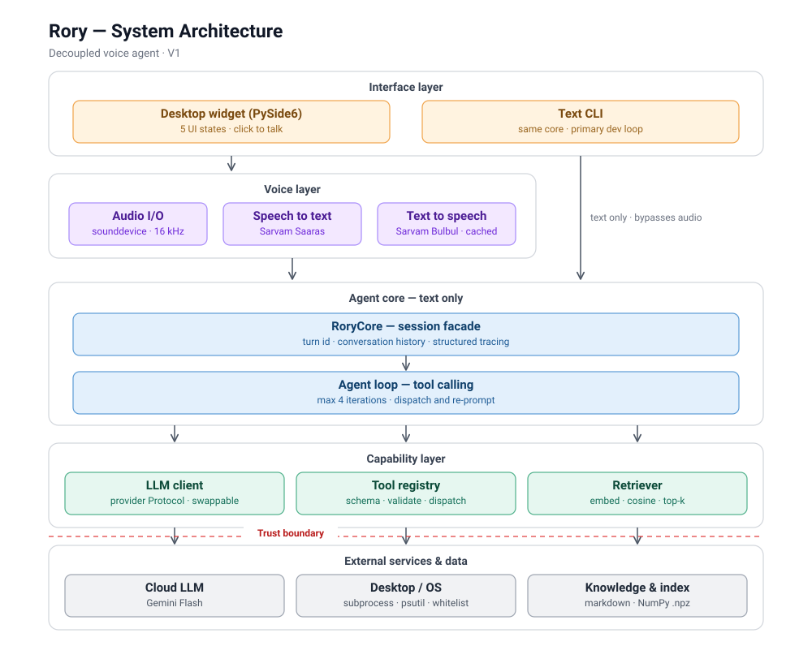
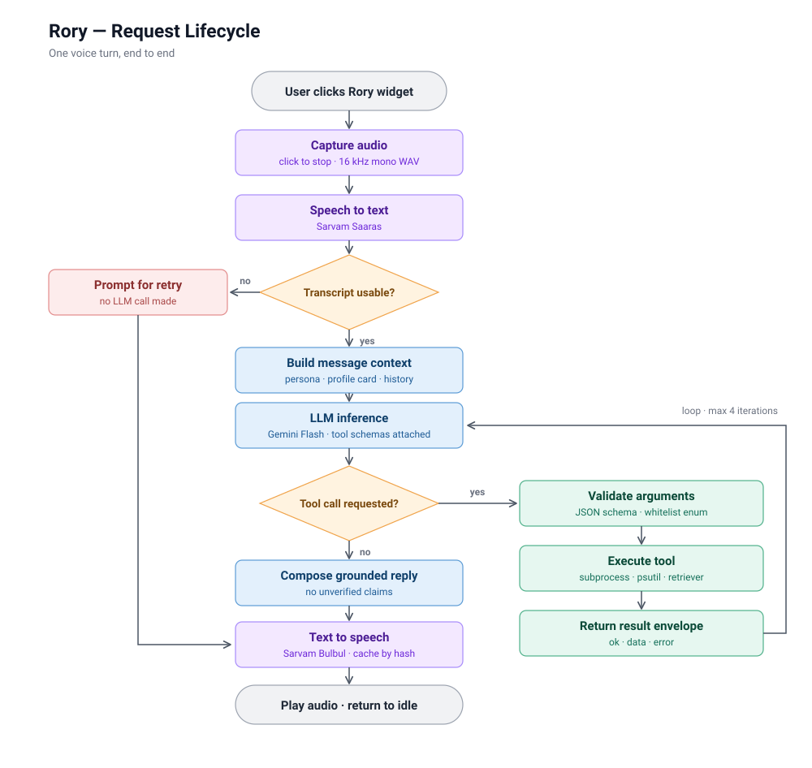

# Rory - My Personal AI Voice Assistant 

## What is Rory?

> A character from my favorite show, Gilmore Girls. 
#### (just kidding)

### Rory is voice first companion that knows about my goals, projects, half baked ideas, and the things I care about while helping me get things done on my desktop. 

#### now let's get nerdy ;)

## Table of Contents

- [What actually is Rory?](#what-actually-is-rory)
- [Why I Built Rory](#why-i-built-rory)
- [V1 Scope](#v1-scope)
- [Architecture](#architecture)
- [Request Lifecycle](#request-lifecycle)
- [Architecture Decisions](#architecture-decisions)

- [RAG](#rag)
- [Memory](#memory)
- [Tool Calling](#tool-calling)
- [Technology Stack](#technology-stack)
- [Security](#security)
- [Failure Handling](#failure-handling)
- [Testing](#testing)
- [Project Structure](#project-structure)

- [Known Limitations](#known-limitations)
- [Future Scope](#future-scope)

## What actually is rory? 

Rory is a personal, voice-first AI agent that combines **Speech-to-Text, LLM-based reasoning, RAG,memory, and controlled tool execution** to understand personal context, respond naturally, and interact with my Linux desktop.

The system follows a modular **STT → LLM → TTS** architecture, with RAG and memory providing context and an explicit tool layer enabling desktop actions.

## Why I Built Rory?

I built Rory because I wanted a project that was **genuinely fun to use while forcing me to understand how AI agents actually work** - from voice pipelines and RAG to memory, tool calling, and system architecture.

I wanted to build something I'd actually enjoy talking to and using every day. Eventually, I want to test if I can get Rory to have different personalities and modes depending on what I want - casual, brainstorming, motivation, rant, and more.

Most importantly, Rory is a **learning project**, where every major engineering decision is intentional and something I should be able to explain.

## V1 Scope

The first version of Rory focuses on the core experience: **talk to Rory, get a relevant response, and let Rory perform a few useful actions.**

V1 includes:

- Voice input and output
- LLM-powered conversation
- Personal knowledge base with RAG
- Conversational memory
- A small set of controlled Linux desktop tools
- Simple desktop interface with click-to-wake
- Decoupled **STT → LLM → TTS** pipeline

V1 intentionally keeps the scope small. **Long-term memory, multiple personality modes, wake-word activation, advanced computer control, and local AI models** are left for future versions.

## Architecture

## Request Lifecycle

